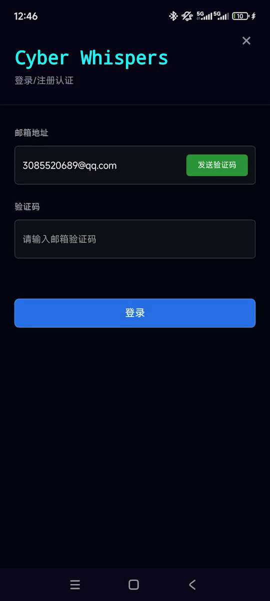
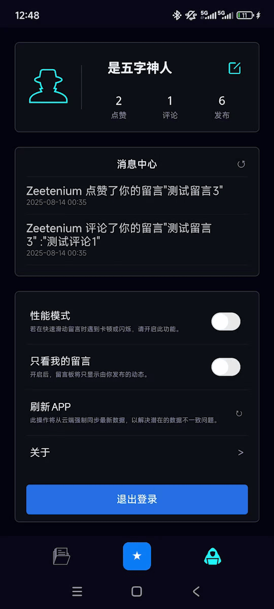

<p align="center">

</p>
<h1 align="center">Cyber Whispers : 轻量级赛博朋克风留言墙</h1>

<p align="center">
<a href="https://github.com/Zeetenium/Cyber-Whispers/releases/latest"></a>
<a href="#-欢迎贡献"></a>
<a href="https://opensource.org/licenses/MIT"></a>


</p>

Cyber Whispers 是一款以赛博朋克风格打造的轻量级留言墙安卓 App，让用户在霓虹闪烁的虚拟空间中自由发表留言、进行互动。

**适合人群：**

-   想快速上手  **Vue3 / UniApp X /UniCloud**  的初学者
-   想找一个低门槛项目练习  **PR / 开源协作**流程的贡献者
-   想参考一个**从 0 到 1 的移动端全栈项目**案例的开发者
-   愿意进行 Review 来指导项目技术的**热心大佬**

## ✨ 项目特性

-   **专为新手设计：**  项目不仅刻意减少了第三方依赖（仅使用两个核心插件），甚至有意去除了诸如 Pinia (状态管理) 和 Vue Router (路由) 这类常见的“脚手架”工具。我们甚至选择不接入  `uni-id`  官方插件，旨在将“黑盒”降至最低，让你能更直观地理解项目构造与底层逻辑，确保每一行核心代码都清晰可读。

-   **完整的全栈体验：**  前端采用  `UniApp X`，后端服务完全基于  `UniCloud`，无需自建服务器，提供了从数据库 (`UniCloud DB`) 到云函数的一站式解决方案，完美诠释了“云端一体化”的开发理念。

-   **现代化的技术栈：**  项目基于  `Uvue` + `Vue3` + `Uts`  等较新的技术构建，可以让你在实践中学习和掌握前沿的开发模式。

-   **清晰的混合开发模式：**  项目巧妙地结合了 `UniApp X` 的原生渲染能力和 `WebView H5` 的灵活性。在两者通信的设计上，H5 模块与 UniApp 的交互被清晰地解耦和封装，所有云端请求也统一收敛至 UniApp 层处理。 这种设计使得前后端职责分明，通信链路一目了然，为你展示了 Hybrid App 开发的一种清晰、高效的实践思路。

-   **开放与协作友好：**  无论你是删除一行多余注释，还是实现一个新功能，我们都张开双臂欢迎。你的每一次  [Pull Request](https://github.com/Zeetenium/Cyber-Whispers/pulls)  都是宝贵的贡献！

## 🚀 主要功能

<table width="100%">
<tr>
<td align="center" valign="top">
<br><br>
<h3>主页留言显示</h3>
</td>
<td align="center" valign="top">
<br><br>
<h3>账号登录与注册</h3>
</td>
</tr>
<tr>
<td align="center" valign="top">
<br><br>
<h3>发表留言</h3>
</td>
<td align="center" valign="top">
<br><br>
<h3>点赞与评论</h3>
</td>
</tr>
<tr>
<td align="center" valign="top" colspan="2">
<br><br>
<h3>用户界面与消息</h3>
</td>
</tr>
</table>

## 🛠️ 技术栈

**总体架构：** Hybrid App (UniApp X + WebView H5)

**移动端技术：** Uvue + UniApp X CSS 子集 + Uts

**移动端插件：** Email-validate-code

**H5 模块技术：** Vue3 + CSS3 + Js

**H5 端插件：** Vue-datepicker-next

**后端服务：** UniCloud

**数据库：** UniCloud DB (NoSQL)

**开发模式：** 云端一体化开发

## 📁 项目结构

```
/H5/
├── public/             # 静态资源
│   └── js/
├── src/                # H5 端源码
│   ├── assets/         # 静态资源（图片、字体等）
│   ├── components/     # Vue 组件
│   ├── composables/    # Vue3 组合式 API （专门与Uniapp通信）
│   ├── styles/         # 公共样式
│   ├── utils/          # 工具函数
│   ├── App.vue         # 根组件
│   └── main.js         # H5 主入口文件
├── package.json        # 项目依赖和脚本配置
├── package-lock.json   # 依赖版本锁定文件
└── vite.config.js      # Vite 配置文件

/Uniapp/
├── components/         # uni-app 组件
├── pages/              # 页面目录
├── static/             # 静态资源（图片、图标等）
├── uniCloud-aliyun/    # uniCloud 阿里云服务空间
│   ├── cloudfunctions/ # 云函数目录
│   └── database/       # 数据库表结构
├── uni_modules/        # uni-app 插件模块
├── main.uts            # Uniapp 主入口文件
├── manifest.json       # 应用清单文件，配置应用名称、图标、权限等
└── pages.json          # 页面路由和窗口表现配置
```

## 📦 快速开始

> 📝 **重要提醒：**
>
> 以下步骤已在作者的开发环境 (Windows 11, HBuilderX 4.75, Node.js v22.12.0) 测试通过。但由于个人精力与设备有限，无法覆盖所有操作系统和环境组合。
>
> 如果你在按照本指南操作时，遇到任何步骤描述不清、命令报错、或与预期不符的情况，**请不要犹豫，立刻[提交一个 Issue](https://github.com/Zeetenium/Cyber-Whispers/issues/new)**！你的反馈对于新朋友快速上手至关重要，也是对本项目非常有价值的贡献。非常感谢！

**开始之前，请确保你已安装以下环境/工具：**

-   [HBuilderX](https://www.dcloud.io/hbuilderx.html)：官方推荐的 IDE，对 UniApp X 和 UniCloud 支持最完善。
-   [Node.js](https://nodejs.org/en/)：用于运行和构建 H5 模块。
-   一个已注册并开通的[UniCloud 服务空间](https://unicloud.dcloud.net.cn/)（项目使用阿里云 其提供免费空间可供使用）。

**步骤如下：**

1. **克隆项目到本地**

    `git clone https://github.com/Zeetenium/Cyber-Whispers.git`

2. **后端初始化 (UniCloud)**

    - 使用 HBuilderX 打开 `Uniapp`  目录。
    - 在左侧项目管理器中，右键点击  `uniCloud-aliyun`  目录，选择“关联云服务空间或项目”。
    - 选择你自己的 UniCloud 服务空间进行关联。
    - 关联成功后，右键点击  `uniCloud-aliyun/database`  文件，选择“初始化云数据库”。
    - 右键点击  `uniCloud-aliyun/cloudfunctions`  目录，选择“上传所有云函数、公共模块及 Action”。

3. **配置邮箱服务（用于发送验证码）**

    - 你需要一个获取了 SMTP 授权码的邮箱。
    - 找到并打开  `Uniapp/uniCloud-aliyun/cloudfunctions/email-validate-code/config.example.json`  文件。
    - 填入你自己的邮箱  `host`、`user`  和  `pass`（`pass`  指的是邮箱的 SMTP 授权码）。
    - 修改完成后，将该文件重命名为  `config.json`（去掉  `.example`  后缀）。
    - 重新上传此云函数，保证云端更新。

4. **构建 H5 模块 (WebView 内容)**

    - 项目中的主页部分是基于 H5 实现的，需要先进行构建。
    - 在终端中进入  `H5`  目录：
      `cd H5`
    - 安装依赖：
      `npm install`
    - 执行构建命令：
      `npm run build`
    - 构建完成后，将  `H5/dist`  目录下的所有文件**复制**到  `Uniapp/hybrid/html`  目录下（如果`hybrid/html`不存在，请手动创建）。这是为了让 App 端的 WebView 组件能加载到本地的 H5 页面。

5. **运行 App**

    - 回到 HBuilderX。
    - 在顶部菜单栏中，点击“运行” -> “运行到手机或模拟器” -> 选择你的设备。
    - HBuilderX 会自动编译并安装应用到你的手机上。现在，你可以开始体验和调试了！

**小贴士：**

-   修改完 H5 代码后，需要重新执行第 4 步来更新 WebView 中的内容。

## 🤝 欢迎贡献

本项目是我作为一名即将大二的前端小白，在未接触过 Uniapp 也未完成过全栈项目的情况下，耗时 18 天独立完成的（想了解背后故事？[戳这篇博客链接](https://juejin.cn/post/7539031990184738826)），其中必然有很多考虑不周、可以优化之处。正如我在视频里分享的，这段经历充满的不仅仅是各种挑战，还有无奈的妥协，但也正因如此，它才是一个无比真实的学习案例。

无论你是身经百战的开发者，还是和我一样正在摸索前行的新人，我都诚挚地欢迎你参与到这个项目中来。你的任何一点帮助，对我而言都是宝贵的鼓励和学习机会。

你可以通过以下几种方式参与贡献：

-   **💡 提出建议与想法**
    -   对项目的架构、代码逻辑、UI 设计或交互体验提出宝贵建议。
    -   有任何天马行空的功能想法？请不要犹豫，立刻[提出一个 Issue](https://github.com/Zeetenium/Cyber-Whispers/issues/new)！用户的真实反馈是项目迭代最宝贵的财富。
-   **🐛 修复 Bug 与优化代码**
    -   帮忙修复已知问题（可以查看代码内的  `TODO`  或 Github 的 Issue 列表）。
    -   发现更优雅、更高效的实现方式？欢迎直接提交 Pull Request！
-   **✨ 实现新功能**
    -   为项目增加一个你认为很酷或实用的小功能，这是一个绝佳的练手平台。
-   **📝 完善文档与代码质量**
    -   包括但不限于修正不合理的代码注释、删除多余的 CSS 样式或代码，甚至可以为三端通信写一份接口文档！
    -   这不仅能帮助项目变得更好，也能让你轻松完成你的第一次 PR，熟悉 Github 的协作流程。

每一次贡献，无论大小，都会被认真对待！

> **给潜在贡献者的一段悄悄话：**
>
> 如果你对参与这个项目很感兴趣，无论是想了解项目的细节，对部分代码抱有疑问，亦或是有一些初步的想法想快速交流，欢迎直接添加我的 QQ：`3085520689`。
>
> 如果项目意外收获了关注，我们还可以建立一个交流群，让协作变得更加轻松有趣！

## 📜 许可证 (License)

本项目采用 [MIT](LICENSE) 许可证。
